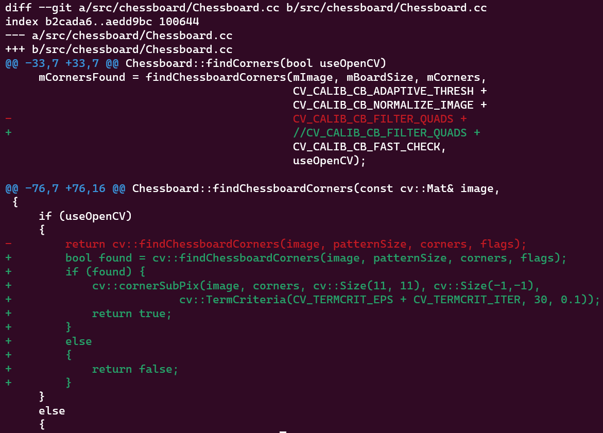

# 开源实现

# [camodocal](https://github.com/hengli/camodocal)

## 编译：

- 编译 opencv 3.4.3
- 编译 ceres 1.14.x
    
    如果遇到 TBB 相关的 error，参见 [https://github.com/ceres-solver/ceres-solver/issues/669](https://github.com/ceres-solver/ceres-solver/issues/669)
    
    要想安装 ceres 1.14.x，得先将 eigen 版本从 3.4.0 降到 3.3.7 (需要 sudo make install)，之后再编译 ceres (也需要 sudo make install)
    
- cmake 命令改为
    
    ```bash
    OpenCV_DIR=/home/ywt/Downloads/opencv/build/ cmake -DCMAKE_BUILD_TYPE=Release ..
    ```
    
- 总算编译成功了

## 运行

在 `build` 文件夹下：

### 单目标定

- encrypted 相机
    - 不使用 opencv 检测 chessboard corners
        
        ```bash
        bin/intrinsic_calib -i ../../../data/chessboard/mono/encrypted -p 20230318190353_00 --camera-model mei -w 11 -h 8 -s 5 --view-results -v --camera-name mono_encrypted
        ```
        
        最终检测出来的棋盘格的图像少，但是最终的 RMS  **0.178** pixel
        
    - 使用 opencv 检测 chessboard corners
        
        ```bash
        bin/intrinsic_calib -i ../../../data/chessboard/mono/encrypted -p 20230318190353_00 --camera-model mei -w 11 -h 8 -s 5 --view-results -v --camera-name mono_encrypted --opencv
        ```
        
        最终检测出来棋盘格的图像多，但是最终的 RMS **0.437** pixels
        
    
    至于具体用哪一个，看最终的双目标定效果吧
    
- unenrypted 相机
    - 不使用 opencv 检测 chessboard corners
        
        ```bash
        bin/intrinsic_calib -i ../../../data/chessboard/mono/unencrypted/ -p 20000101000112_00 --camera-model mei -w 11 -h 8 -s 5 --view-results -v --camera-name mono_unencrypted
        ```
        
        RMS: **0.159** pixels
        
    - 使用 opencv 检测 chessboard corners
        
        ```bash
        bin/intrinsic_calib -i ../../../data/chessboard/mono/unencrypted/ -p 20000101000112_00 --camera-model mei -w 11 -h 8 -s 5 --view-results -v --camera-name mono_unencrypted --opencv
        ```
        
        RMS: **0.429** pixels
        
- 发现源码中使用 opencv 检测 corners 时，没有调用 `cv::cornerSubPix` 函数，所以 RMS 会比较高。对源码的 `src/chessboard/Chessboard.cc` 进行如下改动：
    
    
    
    改动过后重新 `build` ，opencv 的 RMS 也降下去了，且最终检测出的棋盘格数量多！
    
    **以后都用 opencv 检测 chessboard corners!**
    

### 双目标定

- 不使用 opencv 检测 chessboard corners
    
    ```bash
    bin/stereo_calib -i ../../../data/chessboard/stereo/stereo_for_camodocal  --prefix-l 20230318203137 --prefix-r 20000101000112 --camera-model mei -w 11 -h 8 -s 5 -o stereo_calib_results --camera-name-l encrypted --camera-name-r unencrypted --view-results -v
    ```
    
    **立体标定结果跑偏了（可视化出来发现有的完全投影到一个点了，可能代码有bug）:**
    
    ```bash
    [stereo]# INFO: Final extrinsics: 
    r: -0.024  p: -0.004  yaw: -0.002
    x: -4.401  y: 0.073  z: 0.112
    [encrypted] # INFO: Final reprojection error: 8.176 pixels
    [encrypted] # INFO: Camera Parameters:
        model_type MEI
       camera_name encrypted
       image_width 1352
      image_height 1080
    Mirror Parameters
                xi 1.7456777497
    Distortion Parameters
                k1 -0.8690115797
                k2 1.4844062514
                p1 0.0021079490
                p2 -0.0015499130
    Projection Parameters
            gamma1 1856.6846583852
            gamma2 1854.9008421131
                u0 693.6701873901
                v0 548.2590835053
    
    [unencrypted] # INFO: Final reprojection error: 8.390 pixels
    [unencrypted] # INFO: Camera Parameters:
        model_type MEI
       camera_name unencrypted
       image_width 1352
      image_height 1080
    Mirror Parameters
                xi 1.9887956989
    Distortion Parameters
                k1 -0.8869004800
                k2 2.0184457872
                p1 -0.0042330978
                p2 -0.0054299354
    Projection Parameters
            gamma1 2039.5775764808
            gamma2 2039.7599861998
                u0 704.0749925995
                v0 527.9487615283
    ```
    
- 使用 opencv 检测 chessboard corners
    
    ```bash
    bin/stereo_calib -i ../../../data/chessboard/stereo/stereo_for_camodocal  --prefix-l 20230318203137 --prefix-r 20000101000112 --camera-model mei -w 11 -h 8 -s 5 -o stereo_calib_results --camera-name-l encrypted --camera-name-r unencrypted --view-results -v --opencv
    ```
    
    **立体标定结果正确：**
    
    ```bash
    [stereo]# INFO: Final extrinsics: 
    r: -0.024  p: -0.005  yaw: -0.002
    x: -4.399  y: 0.070  z: 0.112
    [encrypted] # INFO: Final reprojection error: 0.190 pixels
    [encrypted] # INFO: Camera Parameters:
        model_type MEI
       camera_name encrypted
       image_width 1352
      image_height 1080
    Mirror Parameters
                xi 1.5829971426
    Distortion Parameters
                k1 -0.8320752543
                k2 1.1921305159
                p1 0.0018399102
                p2 -0.0014407176
    Projection Parameters
            gamma1 1744.4069888389
            gamma2 1742.7364315728
                u0 693.6889199714
                v0 548.2655957386
    
    [unencrypted] # INFO: Final reprojection error: 0.185 pixels
    [unencrypted] # INFO: Camera Parameters:
        model_type MEI
       camera_name unencrypted
       image_width 1352
      image_height 1080
    Mirror Parameters
                xi 1.8886371993
    Distortion Parameters
                k1 -0.8662795504
                k2 1.7587469769
                p1 -0.0042289216
                p2 -0.0051488663
    Projection Parameters
            gamma1 1968.8700982525
            gamma2 1969.0922193368
                u0 704.0914780589
                v0 528.0053915684
    ```
    
    **貌似左右相机是否正确对应对结果影响不大，不过还是尽量弄对。**