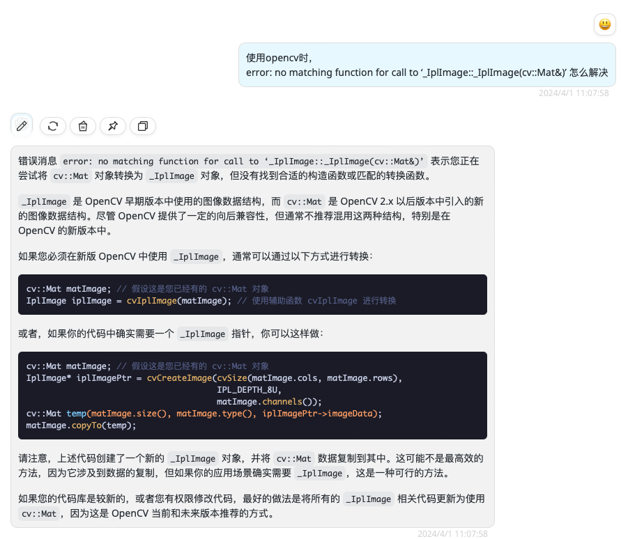

# camodocal 编译遇到的问题及解决方法
- 1. 使用自带的ceres-solver
- 2. 提供opencv路径
-DCMAKE_PREFIX_PATH=/data/lib/opencv/install/include/opencv4
- 3. 编译提供的SuiteSparse
- 4. 改代码，原版使用的opencv3，适配opencv4
https://blog.csdn.net/weixin_43848456/article/details/123380782
```cpp
// #include <opencv/cv.h>
#include <opencv2/imgproc.hpp>
#include <opencv2/highgui/highgui_c.h>
#include <opencv2/imgproc/imgproc_c.h>
#include <opencv2/imgproc/types_c.h>
#include <opencv2/calib3d/calib3d_c.h>


CvMat cvmat = cv::cvarrToMat(mat);
```

- 5. error: no matching function for call to ‘_IplImage::_IplImage(cv::Mat&)’


- 6. CV_FM_RANSAC->cv::FM_RANSAC
- 7. error: conversion from ‘cv::Mat’ to non-scalar type ‘CvMat’ requested
CvMat p1 = *cvGetMat(&points1, NULL, 0); 
- 8. findEssentialMat的二义性ambiguous
改名为findEssentialMat_camodocal
- 9. sudo apt-get install libopenexr-dev
- 10. 关闭代码中所有的cv.imshow
